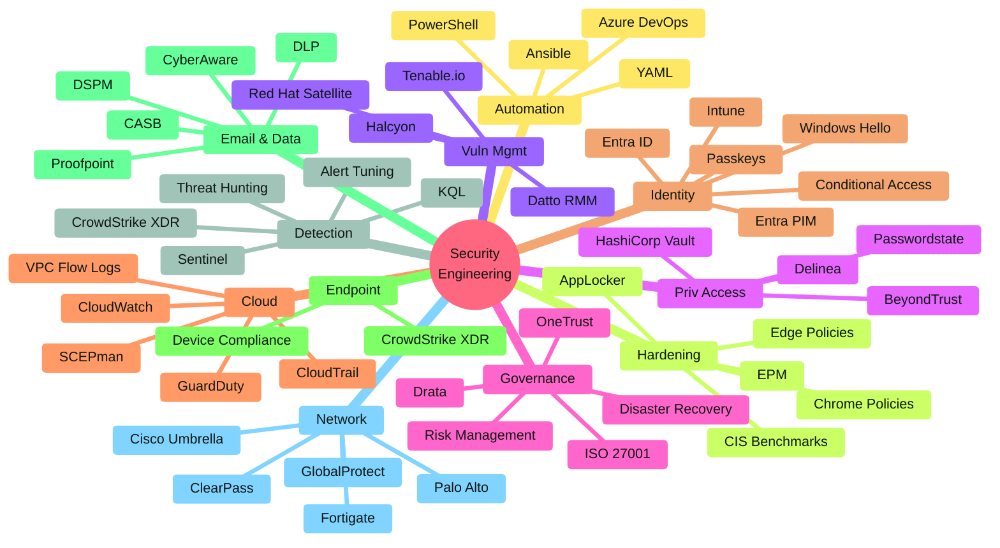

```mermaid
%%{init: {'theme':'base','themeVariables':{
  'primaryColor':'#141f21',
  'primaryTextColor':'#d4e0e2',
  'primaryBorderColor':'#cda41d',
  'lineColor':'#5f888c',
  'secondaryColor':'#0f1719',
  'tertiaryColor':'#0d1416',
  'background':'#080c0d',
  'mainBkg':'#141f21',
  'nodeBorder':'#cda41d',
  'clusterBkg':'#0f1719',
  'titleColor':'#cda41d',
  'edgeLabelBackground':'#0d1416',
  'fontFamily':'Share Tech Mono'
}}}%%
flowchart LR
  A["`**User Device**
  Endpoint`"]
  B["`**Identity Provider**
  Microsoft Entra ID`"]
  C["`**Conditional Access**
  Device Compliance`"]
  D["`**Cloud Infrastructure**
  AWS · Azure`"]
  E["`**Security Telemetry**
  CloudTrail · GuardDuty
  VPC Flow Logs`"]
  F["`**SIEM Platform**
  Microsoft Sentinel`"]
  G["`**Detection Engineering**
  KQL · Threat Hunting`"]
  H["`**Incident Response**
  Automation Playbooks`"]
  A --> B --> C --> D --> E --> F --> G --> H
```

<p align="center">

</p>

<p align="center">
  
</p>

<br>

<p align="center">
  <a href="https://www.linkedin.com/in/nicole-k-1842a4221/">
    
  </a>
   
  <a href="mailto:kempn184@gmail.com">
    
  </a>
   
  
   
  <a href="https://www.iso.org/standard/27001">
    
  </a>
   
  <a href="https://www.iso.org/standard/42001">
    
  </a>
   
  <a href="https://github.com/Angry-Pomeranian/Security-Governance-Operations-Documentation-Portfolio/blob/main/LICENSE.md"> 
    
  </a>
   
  <a href="https://github.com/Angry-Pomeranian/Security-Governance-Operations-Documentation-Portfolio/blob/main/SECURITY.md">
    
  </a>
</p>

<br>

<p align="center">
  
</p>

<br>

## `> whoami`

This repository is a curated portfolio of **enterprise security engineering** work — spanning identity security, cloud telemetry, SIEM detection, infrastructure hardening, and security automation.

The focus is on **how controls are designed, implemented, and operationalized** — not theoretical frameworks.

<br>

<p align="center">

| 🧭  [Overview](https://github.com/Angry-Pomeranian/Security-Governance-Operations-Documentation-Portfolio/tree/main/about) | 👤  [About Me](https://github.com/Angry-Pomeranian/Security-Governance-Operations-Documentation-Portfolio/tree/main/about) | 🏗  [Architecture](https://github.com/Angry-Pomeranian/Security-Governance-Operations-Documentation-Portfolio/tree/main/architecture) | 🧠  [Diagrams](https://github.com/Angry-Pomeranian/Security-Governance-Operations-Documentation-Portfolio/tree/main/diagrams) |
|:---:|:---:|:---:|:---:|
| **📁  [Projects](https://github.com/Angry-Pomeranian/Security-Governance-Operations-Documentation-Portfolio/tree/main/projects)** | **🔍  [Case Studies](https://github.com/Angry-Pomeranian/Security-Governance-Operations-Documentation-Portfolio/tree/main/case-studies)** | **📊  [Reference](https://github.com/Angry-Pomeranian/Security-Governance-Operations-Documentation-Portfolio/tree/main/reference)** | **🎓  [Certifications](https://github.com/Angry-Pomeranian/Security-Governance-Operations-Documentation-Portfolio/tree/main/certification)** |

</p>

<br>

<p align="center">
  
</p>

<br>

<p align="center">
  
</p>

<br>

<table width="100%">
  <tr>
    <td width="50%" valign="top" bgcolor="#1a0a0f">
      <h3>🔭  Currently Working On</h3>
      <p>Advancing enterprise security governance and operational maturity through <strong>ISO 27001 aligned controls, identity security architecture, vulnerability management, SIEM-driven monitoring, and GenAI governance</strong> (shadow AI discovery, DLP in AI workflows, and adaptive access controls).</p>
    </td>
    <td width="50%" valign="top" bgcolor="#0d1416">
      <h3>👯  Looking to Collaborate On</h3>
      <p>Security program maturity initiatives, detection engineering, and enterprise security control implementation.</p>
    </td>
  </tr>
  <tr>
    <td width="50%" valign="top" bgcolor="#0d1416">
      <h3>🌱  Currently Learning</h3>
      <p>Advanced security architecture, cloud monitoring pipelines, and detection engineering at scale.</p>
    </td>
    <td width="50%" valign="top" bgcolor="#1a0a0f">
      <h3>💬  Ask Me About</h3>
      <p>ISO 27001 programs, Conditional Access architecture, Microsoft Sentinel, vulnerability management lifecycle, security control implementation, and GenAI governance (Proofpoint AI governance, CASB, DLP in AI workflows).</p>
    </td>
  </tr>
  <tr>
    <td width="50%" valign="top" bgcolor="#1a0a0f">
      <h3>🤝  Looking For Help With</h3>
      <p>Scaling security architecture and automation across hybrid and cloud environments.</p>
    </td>
    <td width="50%" valign="top" bgcolor="#0d1416">
      <h3>⚡  Fun Fact</h3>
      <p>Many of the security capabilities here were <strong>self-driven</strong> — researching, designing, testing, and implementing controls from the ground up across operational environments.</p>
    </td>
  </tr>
</table>

<br>

<p align="center">
  
</p>

<br>

<p align="center">
  
</p>

<br>

### 🛡  Identity & Access Security

<p>
  <a href="https://learn.microsoft.com/en-us/entra/identity/"></a>
  <a href="https://learn.microsoft.com/en-us/entra/identity/conditional-access/overview"></a>
  <a href="https://learn.microsoft.com/en-us/mem/intune/"></a>
  <a href="https://learn.microsoft.com/en-us/windows/security/identity-protection/hello-for-business/"></a>
  <a href="https://learn.microsoft.com/en-us/entra/identity/authentication/concept-authentication-authenticator-app"></a>
  <a href="https://learn.microsoft.com/en-us/entra/identity/authentication/concept-authentication-passwordless"></a>
  <a href="https://learn.microsoft.com/en-us/entra/id-governance/privileged-identity-management/"></a>
</p>

### 📊  Security Monitoring & Detection

<p>
  <a href="https://learn.microsoft.com/en-us/azure/sentinel/"></a>
  <a href="https://learn.microsoft.com/en-us/azure/data-explorer/kusto/query/"></a>
  <a href="https://www.crowdstrike.com/en-us/cybersecurity-101/endpoint-security/extended-detection-and-response-xdr/"></a>
  <a href="https://learn.microsoft.com/en-us/azure/sentinel/hunting"></a>
  <a href="https://learn.microsoft.com/en-us/azure/sentinel/detect-threats-built-in"></a>
</p>

### ☁  Cloud Security & Telemetry

<p>
  <a href="https://aws.amazon.com/security/"></a>
  <a href="https://docs.aws.amazon.com/cloudtrail/"></a>
  <a href="https://docs.aws.amazon.com/guardduty/"></a>
  <a href="https://docs.aws.amazon.com/vpc/latest/userguide/flow-logs.html"></a>
  <a href="https://docs.aws.amazon.com/cloudwatch/"></a>
  <a href="https://docs.scepman.com"></a>
</p>

### 🧱  Infrastructure Hardening & Endpoint

<p>
  <a href="https://www.cisecurity.org/cis-benchmarks"></a>
  <a href="https://learn.microsoft.com/en-us/windows/security/application-security/application-control/windows-defender-application-control/applocker/applocker-overview"></a>
  <a href="https://learn.microsoft.com/en-us/deployedge/microsoft-edge-policies"></a>
  <a href="https://chromeenterprise.google/policies/"></a>
  <a href="https://learn.microsoft.com/en-us/mem/intune/protect/epm-overview"></a>
</p>

### 📜  Security Governance & Compliance

<p>
  <a href="https://www.iso.org/contents/data/standard/05/45/54534.html"></a>
  <a href="https://www.iso.org/standard/27001"></a>
  <a href="https://www.iso.org/standard/42001"></a>
  <a href="https://www.tenable.com/solutions/vulnerability-management"></a>
  
  
  <a href="https://www.onetrust.com/"></a>
  <a href="https://drata.com/"></a>
</p>

### 🔗  Security Platforms & Integrations

<p>
  <a href="https://www.proofpoint.com/au"></a>
  <a href="https://umbrella.cisco.com/"></a>
  <a href="https://www.paloaltonetworks.com/network-security/panorama"></a>
  <a href="https://www.fortinet.com/products/next-generation-firewall"></a>
  <a href="https://www.paloaltonetworks.com/sase/globalprotect"></a>
  <a href="https://www.arubanetworks.com/products/security/network-access-control/"></a>
</p>

### 🔑  Privileged Access & Secrets

<p>
  <a href="https://developer.hashicorp.com/vault/docs"></a>
  <a href="https://www.beyondtrust.com/"></a>
  <a href="https://delinea.com/"></a>
  <a href="https://www.clickstudios.com.au/passwordstate.aspx"></a>
  <a href="https://mobaxterm.mobatek.net/"></a>
</p>

### 🩺  Vulnerability Management

<p>
  <a href="https://www.tenable.com/products/tenable-io"></a>
  <a href="https://www.redhat.com/en/technologies/management/satellite"></a>
  <a href="https://www.datto.com/products/rmm/"></a>
  <a href="https://halcyon.ai/"></a>
  <a href="https://www.lenovo.com/us/en/software/xclarity"></a>
</p>

### ⚙  Security Automation

<p>
  <a href="https://learn.microsoft.com/en-us/powershell/"></a>
  <a href="https://yaml.org/"></a>
  <a href="https://docs.ansible.com/"></a>
  <a href="https://learn.microsoft.com/en-us/azure/devops/"></a>
</p>

### 💻  Languages

<p>
  <a href="https://docs.python.org/3/"></a>
  <a href="https://developer.mozilla.org/en-US/docs/Web/JavaScript"></a>
  <a href="https://dev.java/learn/"></a>
  <a href="https://developer.mozilla.org/en-US/docs/Web/CSS"></a>
  <a href="https://developer.mozilla.org/en-US/docs/Web/HTML"></a>
  <a href="https://learn.microsoft.com/en-us/azure/data-explorer/kusto/query/"></a>
  <a href="https://www.gnu.org/software/bash/manual/bash.html"></a>
  <a href="https://www.json.org/json-en.html"></a>
  <a href="https://developer.hashicorp.com/terraform/language"></a>
  <a href="https://developer.mozilla.org/en-US/docs/Web/XML/XML_introduction"></a>
  <a href="https://www.markdownguide.org/"></a>
  <a href="https://www.regular-expressions.info/"></a>
</p>

<br>

<p align="center">
  
</p>

<br>

<p align="center">
  
</p>

<br>

<p align="center">

| Domain | Focus | Proficiency |
|--------|-------|-------------|
| 🛡  **Identity & Access Security** | Conditional Access architecture, phishing-resistant MFA, passwordless deployment, and Entra PIM |  |
| 📊  **Detection Engineering & SIEM** | Sentinel connector deployment, KQL analytics rules, threat hunting queries, and workbook development |  |
| 🧱  **Infrastructure Hardening** | CIS benchmark configurations for Windows, RHEL, and enterprise browsers; Intune and GPO enforcement |  |
| ☁  **Cloud Security & Telemetry** | AWS CloudTrail, GuardDuty, and VPC Flow Logs ingestion into Sentinel via S3 and SQS pipelines |  |
| 📜  **Governance & ISO 27001** | ISO 27001:2022 control implementation, ASD Essential Eight mapping, and NIST CSF alignment |  |
| 🩺  **Vulnerability Management** | Tenable-based scan and remediation lifecycle, patch tracking, and risk prioritisation |  |
| ⚙  **Security Automation** | PowerShell and YAML automation, Azure Logic Apps, ARM templates, and operational runbooks |  |
| ✉  **Email & Data Security** | Proofpoint AI governance, shadow AI discovery (CASB), GenAI DLP, and adaptive access controls |  |
| 🔑  **Privileged Access** | HashiCorp Vault, BeyondTrust, Delinea, and Passwordstate PAM control implementation |  |
| 🌐  **Network Security** | Cisco Umbrella DNS security, Palo Alto and FortiGate firewall policies, and bypass prevention |  |

</p>

<br>

<p align="center">
  
</p>

<br>

<p align="center">
  
</p>

<br>



<p align="center"><i>Identity controls → telemetry ingestion → SIEM detection → automated response</i></p>

<br>

<p align="center">
  
</p>

<br>

<p align="center">
  
</p>

<br>



<br>

<p align="center">
  
</p>

<br>

<p align="center">
  
</p>

<br>

<table width="100%">
  <tr>
    <th align="left" bgcolor="#1a0800">Project</th>
    <th align="left" bgcolor="#1a0800">Domain</th>
    <th align="left" bgcolor="#1a0800">Description</th>
  </tr>
  <tr>
    <td bgcolor="#1a0a0f"><strong>Identity Conditional Access Architecture</strong></td>
    <td bgcolor="#1a0a0f"></td>
    <td bgcolor="#1a0a0f">Design and implementation of Conditional Access policies enforcing device compliance and risk-based authentication</td>
  </tr>
  <tr>
    <td bgcolor="#0a1614"><strong>Cloud Telemetry Ingestion Pipeline</strong></td>
    <td bgcolor="#0a1614"></td>
    <td bgcolor="#0a1614">Integration of AWS CloudTrail, GuardDuty, and VPC Flow Logs into SIEM for centralised detection</td>
  </tr>
  <tr>
    <td bgcolor="#1a0a0f"><strong>Endpoint Hardening Program</strong></td>
    <td bgcolor="#1a0a0f"></td>
    <td bgcolor="#1a0a0f">CIS benchmark configurations and enterprise browser policy enforcement at scale</td>
  </tr>
  <tr>
    <td bgcolor="#0a1614"><strong>SIEM Detection Engineering</strong></td>
    <td bgcolor="#0a1614"></td>
    <td bgcolor="#0a1614">Detection rule development, threat hunting queries, and alert tuning in Microsoft Sentinel</td>
  </tr>
  <tr>
    <td bgcolor="#1a0a0f"><strong>Security Automation Tooling</strong></td>
    <td bgcolor="#1a0a0f"></td>
    <td bgcolor="#1a0a0f">PowerShell and YAML automation for security control deployment and operational monitoring</td>
  </tr>
  <tr>
    <td bgcolor="#0a1614"><strong>Security Operations Foundation</strong></td>
    <td bgcolor="#0a1614"></td>
    <td bgcolor="#0a1614">Sentinel detection operations foundation, security event investigation methodology, and triage processes</td>
  </tr>
  <tr>
    <td bgcolor="#1a0a0f"><strong>Platform Integration and APIs</strong></td>
    <td bgcolor="#1a0a0f"></td>
    <td bgcolor="#1a0a0f">Cross-platform security tool integrations — Sentinel connectors, Proofpoint TAP, Cisco Umbrella, AWS CloudTrail, and Azure APIs</td>
  </tr>
  <tr>
    <td bgcolor="#0a1614"><strong>DevSecOps and Automation</strong></td>
    <td bgcolor="#0a1614"></td>
    <td bgcolor="#0a1614">Security automation runbooks, deployment templates (ARM/JSON/YAML), and operational playbooks for scale</td>
  </tr>
</table>

<br>

<p align="center">
  
</p>

<br>

<p align="center">
  
</p>

<br>

**Sentinel — Brute Force Detection**

```kql
SecurityEvent
| where EventID == 4625
| summarize FailedAttempts = count() by Account, bin(TimeGenerated, 5m)
| where FailedAttempts > 10
```

> 🔴  Detects brute-force authentication attempts across identity infrastructure.

<br>

**AWS CloudTrail — Console Login Failure**

```kql
AWSCloudTrail
| where EventName == "ConsoleLogin"
| where ResponseElements contains "Failure"
```

> ☁  Detects suspicious console login attempts within cloud environments.

<br>

<p align="center">
  
</p>

<br>

<p align="center">
  
</p>

<br>

<table width="100%">
  <tr>
    <th align="left" bgcolor="#1a0800">Directory</th>
    <th align="left" bgcolor="#1a0800">Description</th>
  </tr>
  <tr>
    <td bgcolor="#0d1416">📁  <strong><code>about/</code></strong></td>
    <td bgcolor="#0d1416">Professional overview — security domains, skills matrix with depth ratings, engineering methodology, and certifications in progress</td>
  </tr>
  <tr>
    <td bgcolor="#1a0a0f">📁  <strong><code>projects/</code></strong></td>
    <td bgcolor="#1a0a0f">Curated project write-ups describing real security implementation work</td>
  </tr>
  <tr>
    <td bgcolor="#0d1416">🏗  <strong><code>architecture/</code></strong></td>
    <td bgcolor="#0d1416">Security architecture documentation explaining system design and monitoring models</td>
  </tr>
  <tr>
    <td bgcolor="#1a0a0f">📚  <strong><code>case-studies/</code></strong></td>
    <td bgcolor="#1a0a0f">Detailed implementation narratives — planning, deployment, and lessons learned</td>
  </tr>
  <tr>
    <td bgcolor="#0d1416">🧠  <strong><code>diagrams/</code></strong></td>
    <td bgcolor="#0d1416">Mermaid architecture diagrams covering the full stack — Sentinel data pipeline, identity auth flow, Umbrella DNS, Proofpoint AI governance, and incident response lifecycle</td>
  </tr>
  <tr>
    <td bgcolor="#1a0a0f">🚨  <strong><code>incident-response/</code></strong></td>
    <td bgcolor="#1a0a0f">ISO 27001 / NIST SP 800-61 aligned playbooks for account compromise, ransomware, phishing, BEC, data exfiltration, cloud account compromise, privileged access abuse, network intrusion, and malicious code execution</td>
  </tr>
  <tr>
    <td bgcolor="#0d1416">📜  <strong><code>compliance/</code></strong></td>
    <td bgcolor="#0d1416">Control mapping and implementation guidance for ASD Essential Eight, ISO 27001:2022, and NIST CSF</td>
  </tr>
  <tr>
    <td bgcolor="#1a0a0f">🎓  <strong><code>certification/</code></strong></td>
    <td bgcolor="#1a0a0f">Study notes, lab guides, and exam resources for SC-300 and AWS Cloud Practitioner</td>
  </tr>
  <tr>
    <td bgcolor="#0d1416">🔄  <strong><code>pipeline/</code></strong></td>
    <td bgcolor="#0d1416">Automated incident response pipeline — impossible travel detection integrated with Sentinel, Entra ID, and SOAR workflows</td>
  </tr>
  <tr>
    <td bgcolor="#1a0a0f">📦  <strong><code>reference/</code></strong></td>
    <td bgcolor="#1a0a0f">Technical reference documentation organised by security domain: identity-access, email-security, network-security, endpoint-hardening, automation, and sentinel (connectors, hunting queries, workbooks, ARM templates)</td>
  </tr>
</table>

<br>

<p align="center">
  
</p>

<br>

<p align="center">
  <picture>
    <source media="(prefers-color-scheme: dark)" srcset="https://raw.githubusercontent.com/Angry-Pomeranian/Security-Governance-Operations-Documentation-Portfolio/output/github-snake-dark.svg">
    <source media="(prefers-color-scheme: light)" srcset="https://raw.githubusercontent.com/Angry-Pomeranian/Security-Governance-Operations-Documentation-Portfolio/output/github-snake.svg">
    
  </picture>
</p>

<br>

<p align="center">
  
</p>
