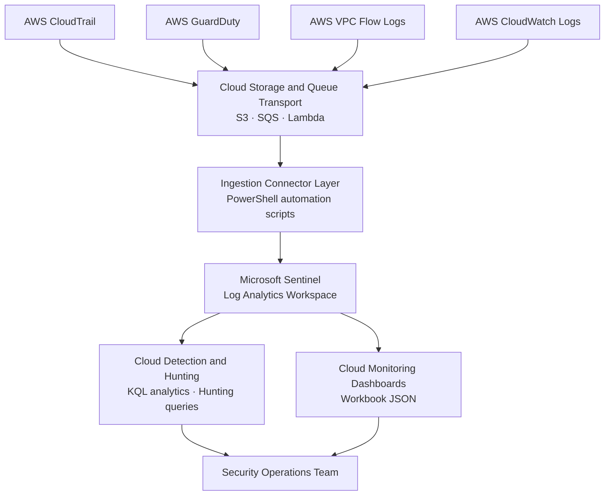

# Cloud Telemetry Ingestion Architecture Diagram

## Overview

High-level view of the AWS-to-Sentinel telemetry pipeline. AWS log sources are forwarded via S3/SQS transport to Sentinel connector scripts, ingested into Log Analytics, and surfaced through cloud-specific detection rules and dashboards.

For the detailed implementation including all PowerShell connector scripts, CloudFormation templates, and step-by-step connector guides, see [`reference/sentinel/`](../reference/sentinel/).

---

## Architecture Diagram

---

## Related Documentation

- [`reference/sentinel/automate-deployment/`](../reference/sentinel/automate-deployment/) — PowerShell connector automation scripts
- [`reference/sentinel/manual/aws/`](../reference/sentinel/manual/aws/) — Manual connector onboarding guides (CloudTrail, GuardDuty)
- [`reference/sentinel/workbooks/`](../reference/sentinel/workbooks/) — Dashboard JSON files
- [Sentinel Data Pipeline diagram](sentinel-data-pipeline.md) — Detailed version of this diagram with all source types and sub-components
