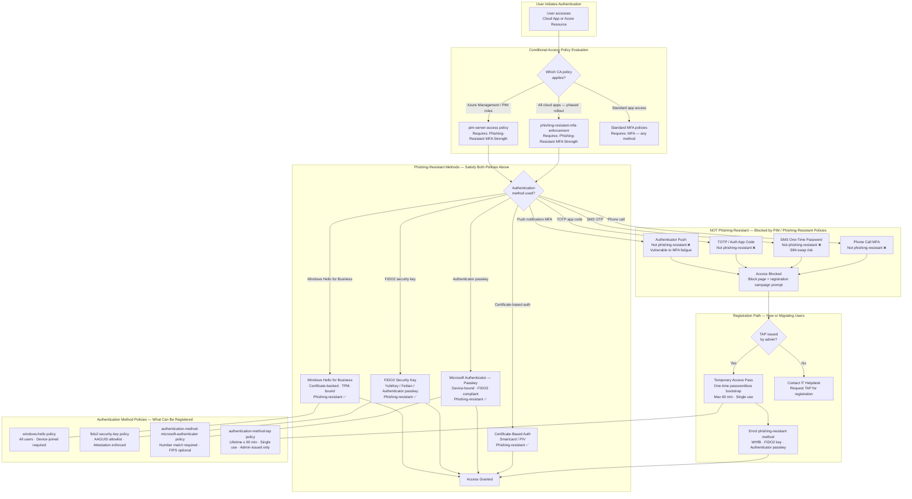

# Identity Authentication Decision

## Overview

This diagram maps the authentication strength decision tree as implemented across the Conditional Access policies in this portfolio. It shows how authentication methods are evaluated for phishing-resistance, which methods satisfy each Conditional Access enforcement tier, and which policies enforce each tier.

This reflects the policies documented in [`reference/identity-access/policies/conditional-access/`](../reference/identity-access/policies/conditional-access/).

---

## Decision Diagram

---

## Policy Files Referenced

| Policy | File |
|---|---|
| `pim-server-access` | [`reference/identity-access/policies/conditional-access/pim-server-access/README.md`](../reference/identity-access/policies/conditional-access/pim-server-access/README.md) |
| `phishing-resistant-mfa-enforcement` | [`reference/identity-access/policies/conditional-access/phishing-resistant-mfa-enforcement/README.md`](../reference/identity-access/policies/conditional-access/phishing-resistant-mfa-enforcement/README.md) |
| `windows-hello` | [`reference/identity-access/policies/conditional-access/windows-hello/README.md`](../reference/identity-access/policies/conditional-access/windows-hello/README.md) |
| `fido2-security-key` | [`reference/identity-access/policies/conditional-access/fido2-security-key/README.md`](../reference/identity-access/policies/conditional-access/fido2-security-key/README.md) |
| `authentication-method-microsoft-authenticator` | [`reference/identity-access/policies/conditional-access/authentication-method-microsoft-authenticator/README.md`](../reference/identity-access/policies/conditional-access/authentication-method-microsoft-authenticator/README.md) |
| `authentication-method-tap` | [`reference/identity-access/policies/conditional-access/authentication-method-tap/README.md`](../reference/identity-access/policies/conditional-access/authentication-method-tap/README.md) |
