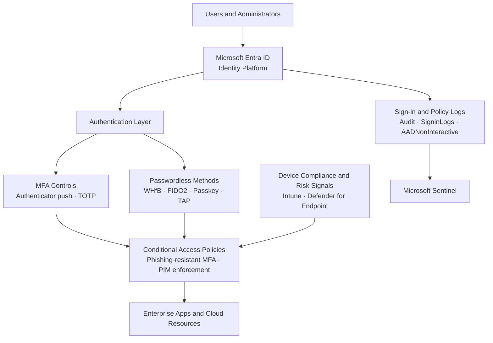

# Identity Security Architecture Diagram

## Overview

High-level view of the identity security architecture: users authenticate through the identity platform, MFA and passwordless controls gate access, Conditional Access policies evaluate device and risk signals before granting app access, and all sign-in activity is forwarded to the SIEM for monitoring.

For the specific policy configurations, validation scripts, and implementation guides, see [`reference/identity-access/`](../reference/identity-access/).

---

## Architecture Diagram

---

## Related Documentation

- [`reference/identity-access/guides/passwordless/`](../reference/identity-access/guides/passwordless/) — Passwordless rollout guides (WHfB, FIDO2, Authenticator, TAP, B2C)
- [`reference/identity-access/policies/conditional-access/`](../reference/identity-access/policies/conditional-access/) — All Conditional Access and Authentication Methods policies
- [Identity Authentication Decision diagram](identity-authentication-decision-tree.md) — Detailed decision tree: what satisfies phishing-resistant MFA strength and what does not
