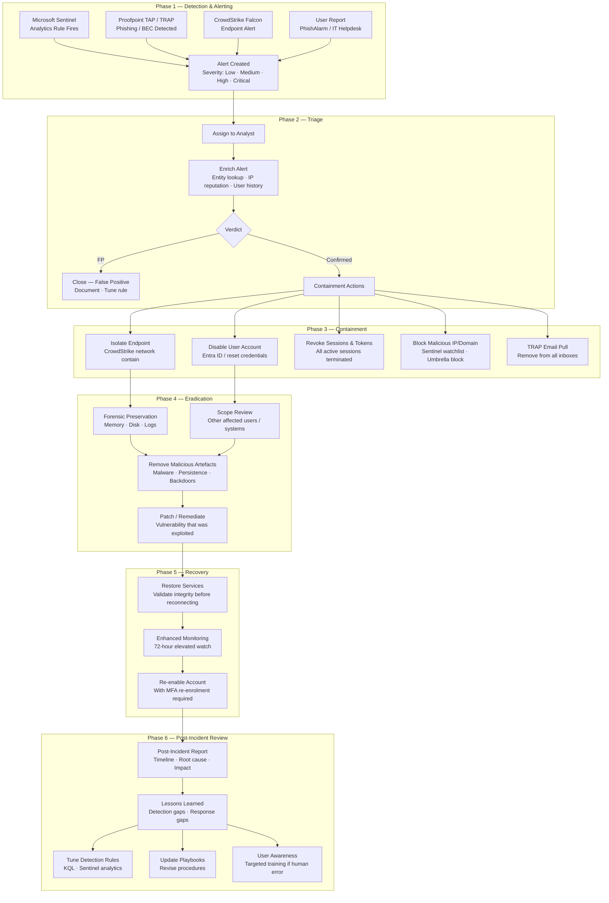

# Incident Response Lifecycle

## Overview

This diagram shows the incident response lifecycle used across all nine playbooks in this portfolio. It maps each phase to the tools, data sources, and decision points that appear consistently in the playbooks — from initial detection through post-incident review. The lifecycle is aligned to ISO 27001:2022 Annex A.5.26 and NIST SP 800-61 Rev 2.

---

## Lifecycle Diagram

---

## Playbooks Using This Lifecycle

| Playbook | Key detection source | Primary containment action |
|---|---|---|
| [Account Compromise](../incident-response/account-compromise-playbook.md) | Sentinel signin anomaly | Disable account + revoke sessions |
| [BEC](../incident-response/business-email-compromise-playbook.md) | Proofpoint TAP / user report | TRAP pull + OAuth revocation |
| [Cloud Account Compromise](../incident-response/cloud-account-compromise-playbook.md) | Sentinel / AWS GuardDuty | Revoke IAM credentials |
| [Data Exfiltration](../incident-response/data-exfiltration-response-playbook.md) | Proofpoint DLP / Sentinel | Block egress + isolate endpoint |
| [Malicious Code Execution](../incident-response/malicious-code-execution-playbook.md) | CrowdStrike Falcon | Network contain endpoint |
| [Network Intrusion](../incident-response/network-intrusion-playbook.md) | Sentinel network analytics | Block IP + segment network |
| [Phishing](../incident-response/phishing-investigation-playbook.md) | Proofpoint TAP | TRAP pull + disable clicked links |
| [Privileged Access Abuse](../incident-response/privileged-access-abuse-playbook.md) | Sentinel PIM logs | Revoke PIM role + audit access |
| [Ransomware](../incident-response/ransomware-response-playbook.md) | CrowdStrike / Sentinel | Immediate network contain |

---

## Related Documentation

- [`incident-response/`](../incident-response/) — All nine incident response playbooks
- [`reference/sentinel/`](../reference/sentinel/) — Sentinel analytics rules and hunting content
- [`reference/identity-access/`](../reference/identity-access/) — Account containment controls (Conditional Access, PIM)
