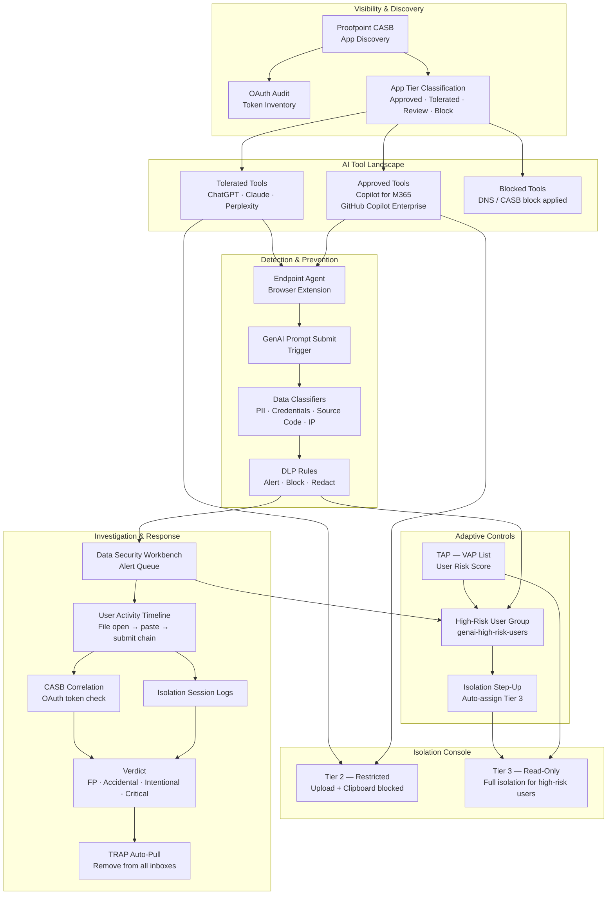

# Proofpoint AI Governance Flow

## Overview

This diagram maps the end-to-end AI governance architecture using the Proofpoint Information and Cloud Security (ICS) platform. It covers the full lifecycle: discovering shadow AI tools via CASB, detecting sensitive data submissions via the Data Security Workbench, restricting access via the Isolation Console, adapting controls using TAP risk data, and auto-remediating via TRAP.

This reflects the nine-guide suite documented in [`reference/email-security/guides/proofpoint/ai-governance/`](../reference/email-security/guides/proofpoint/ai-governance/).

---

## Architecture Diagram

---

## Related Documentation

- [`reference/email-security/guides/proofpoint/ai-governance/README.md`](../reference/email-security/guides/proofpoint/ai-governance/README.md) — Suite overview and implementation sequence
- [`visibility/shadow-ai-discovery-casb.md`](../reference/email-security/guides/proofpoint/ai-governance/visibility/shadow-ai-discovery-casb.md) — CASB discovery and OAuth audit
- [`detection/detecting-sensitive-data-in-ai-prompts.md`](../reference/email-security/guides/proofpoint/ai-governance/detection/detecting-sensitive-data-in-ai-prompts.md) — Agent, trigger, and classifier setup
- [`detection/controlling-ai-site-access-via-isolation.md`](../reference/email-security/guides/proofpoint/ai-governance/detection/controlling-ai-site-access-via-isolation.md) — Isolation tier configuration
- [`governance/adaptive-ai-access-controls.md`](../reference/email-security/guides/proofpoint/ai-governance/governance/adaptive-ai-access-controls.md) — TAP VAP → Isolation step-up
