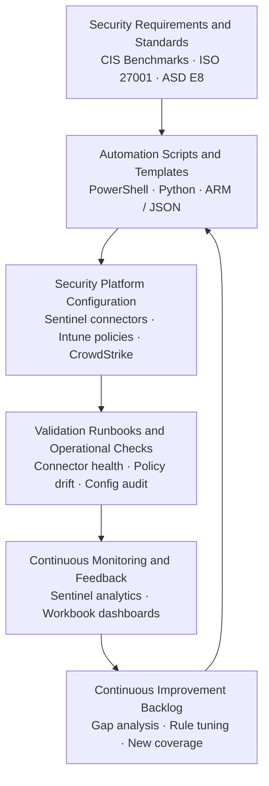

# Security Automation Architecture Diagram

## Overview

Illustrates the continuous automation loop used throughout this portfolio: security requirements drive automation scripts and templates, which configure platforms, which are validated by runbooks, which feed monitoring and a continuous improvement backlog. This loop underpins connector deployment, CIS baseline enforcement, and API integration work.

For implementation examples of this loop in practice, see [`reference/automation/`](../reference/automation/) and [`reference/sentinel/automate-deployment/`](../reference/sentinel/automate-deployment/).

---

## Architecture Diagram

---

## Related Documentation

- [`reference/automation/`](../reference/automation/) — CrowdStrike Falcon API modules, operational scripts, deployment templates
- [`reference/sentinel/automate-deployment/`](../reference/sentinel/automate-deployment/) — AWS connector deployment automation
- [`reference/endpoint-hardening/scripts/`](../reference/endpoint-hardening/scripts/) — CIS benchmark tooling (converter, batch runner)
