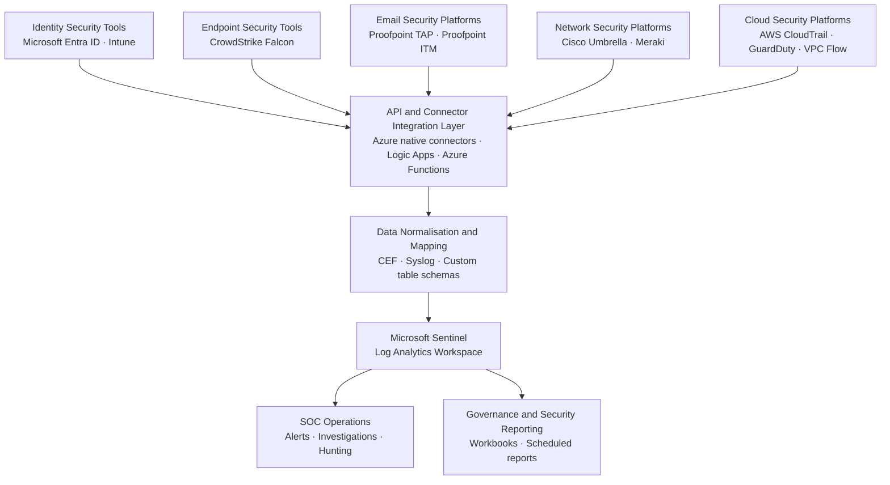

# Security Integration Architecture Diagram

## Overview

Shows how the five security tool categories (identity, endpoint, email/web, network, cloud) are integrated through API and connector layers into the central SIEM, with outputs feeding SOC operations and governance reporting. This reflects the integrations documented across the portfolio's reference section.

---

## Architecture Diagram

---

## Related Documentation

- [`reference/automation/crowdstrike/`](../reference/automation/crowdstrike/) — CrowdStrike API integration modules
- [`reference/email-security/api/proofpoint/`](../reference/email-security/api/proofpoint/) — Proofpoint TAP Azure Function pipeline
- [`reference/network-security/api/meraki/`](../reference/network-security/api/meraki/) — Cisco Meraki API integration
- [`reference/sentinel/manual/`](../reference/sentinel/manual/) — Manual connector guides for all platforms
- [`reference/sentinel/workbooks/`](../reference/sentinel/workbooks/) — Governance dashboards per platform
