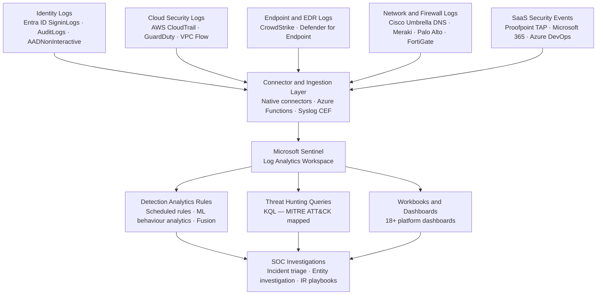

# Security Monitoring Architecture Diagram

## Overview

Shows the centralised security monitoring architecture: five log source categories flow through connectors into Microsoft Sentinel, where they feed detection analytics, threat hunting queries, and workbook dashboards consumed by the SOC. This is the detection and visibility layer documented throughout the Sentinel section of this portfolio.

---

## Architecture Diagram

---

## Related Documentation

- [`reference/sentinel/`](../reference/sentinel/) — All Sentinel deployment resources, queries, templates, and workbooks
- [`reference/sentinel/hunting/`](../reference/sentinel/hunting/) — KQL threat hunting content
- [`reference/sentinel/templates/`](../reference/sentinel/templates/) — Analytics rule ARM templates
- [`reference/sentinel/workbooks/`](../reference/sentinel/workbooks/) — Dashboard JSON files for all 18+ platforms
- [Sentinel Data Pipeline diagram](sentinel-data-pipeline.md) — Detailed version showing source-to-SOC pipeline components
