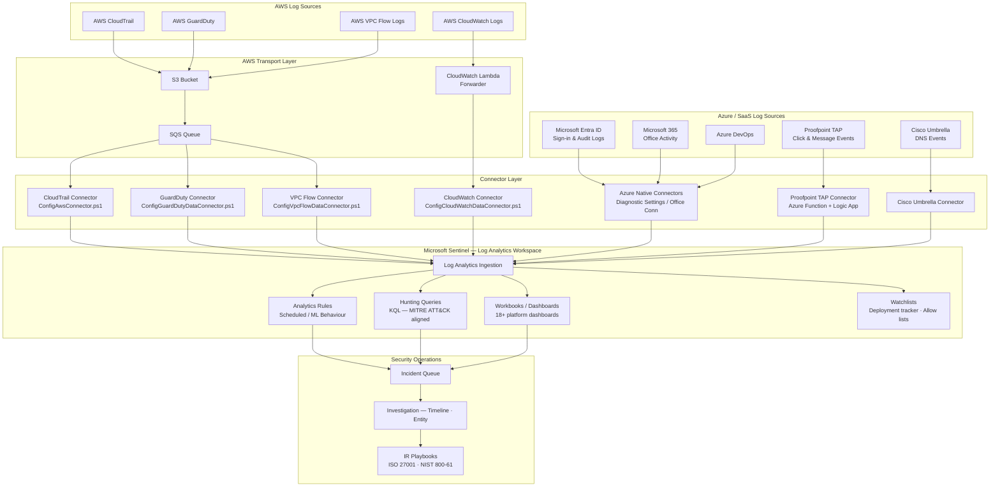

# Sentinel Data Pipeline

## Overview

This diagram shows the end-to-end Microsoft Sentinel data ingestion pipeline as implemented in this portfolio — from AWS and Azure/SaaS log sources through connector deployment and ingestion into Log Analytics, to analytics rules, hunting content, workbooks, and SOC response.

This reflects the actual content in [`reference/sentinel/`](../reference/sentinel/): the AWS automation scripts, CloudFormation templates, manual connector guides, KQL hunting queries, and workbook JSON files.

---

## Architecture Diagram

---

## Related Documentation

- [`reference/sentinel/automate-deployment/`](../reference/sentinel/automate-deployment/) — PowerShell scripts that configure each AWS connector (`ConfigAwsConnector.ps1`, `ConfigGuardDutyDataConnector.ps1`, etc.)
- [`reference/sentinel/manual/`](../reference/sentinel/manual/) — Manual connector setup guides (AWS, Azure, Cisco Umbrella, Proofpoint TAP)
- [`reference/sentinel/hunting/`](../reference/sentinel/hunting/) — KQL threat hunting queries
- [`reference/sentinel/workbooks/`](../reference/sentinel/workbooks/) — Dashboard JSON for 18+ platforms
- [`reference/sentinel/templates/`](../reference/sentinel/templates/) — ARM templates for analytics rules and ML behaviour analytics
- [`reference/email-security/api/proofpoint/`](../reference/email-security/api/proofpoint/) — Proofpoint TAP Azure Function pipeline
