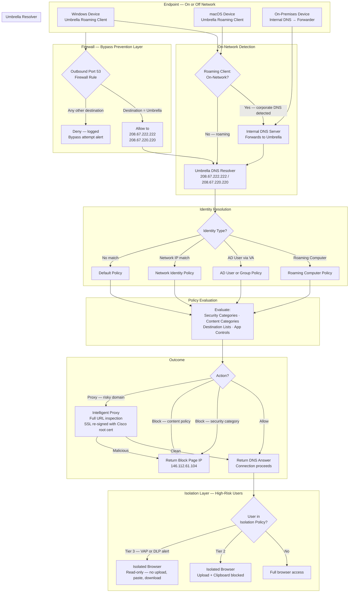

# Umbrella DNS Security Flow

## Overview

This diagram shows the full DNS query path through Cisco Umbrella — from a device making a DNS request through identity resolution, policy evaluation, and enforcement to the final allow/block/isolate outcome. It also shows the bypass prevention firewall layer and the roaming client on/off-network logic.

This reflects the implementation documented in [`reference/network-security/guides/umbrella/`](../reference/network-security/guides/umbrella/).

---

## DNS Query Flow

---

## Related Documentation

- [`reference/network-security/guides/umbrella/deployment/dns-layer-security-setup-guide.md`](../reference/network-security/guides/umbrella/deployment/dns-layer-security-setup-guide.md) — DNS forwarder configuration and verification
- [`reference/network-security/guides/umbrella/administration/policy-management-and-precedence-guide.md`](../reference/network-security/guides/umbrella/administration/policy-management-and-precedence-guide.md) — Identity resolution order and policy evaluation
- [`reference/network-security/guides/umbrella/troubleshooting/dns-bypass-prevention-guide.md`](../reference/network-security/guides/umbrella/troubleshooting/dns-bypass-prevention-guide.md) — Firewall rules to enforce DNS routing
- [`reference/network-security/guides/umbrella/deployment/roaming-client-mass-deployment-guide.md`](../reference/network-security/guides/umbrella/deployment/roaming-client-mass-deployment-guide.md) — On-network detection and roaming client
